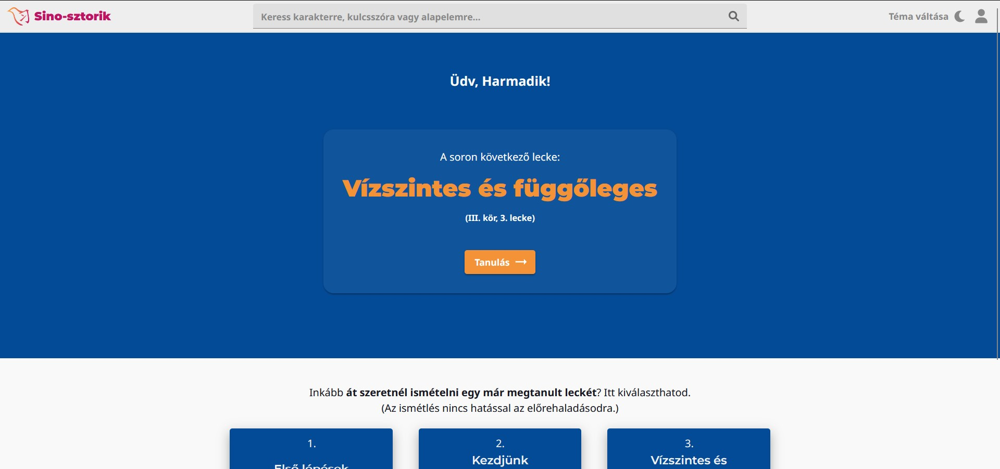
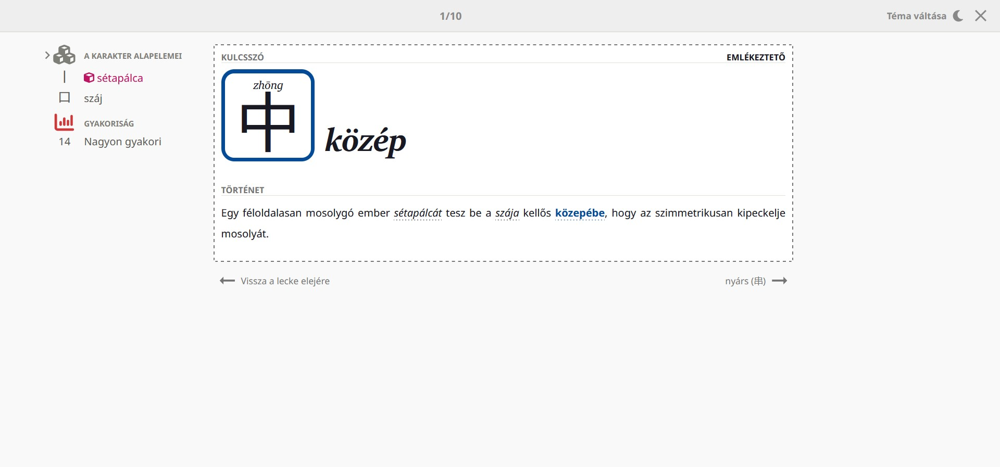
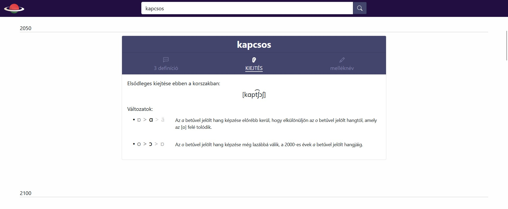

### Greetings!

Hi, I'm Dávid! Welcome to my GitHub.
Here's an overview of my side projects.

## [Sino-sztorik](https://sino-sztorik.web.app/)

Sino-sztorik is a web app (in progress) for Hungarian learners of Chinese. It teaches Chinese characters through visual associations and stories.

It's made with React and [MUI](https://mui.com) in JavaScript, and is connected to a MySQL database through a [Node.js/Express backend](https://github.com/x22tri/sino-sztorik-backend).

  
  

## [HUXXIV](https://x22tri.github.io/huxxiv/)

HUXXIV is a TypeScript + React web app (in pre-alpha) that tracks how Hungarian words will change in the next three centuries, including changes in meaning, pronunciation and inflection.

  

## Contact
- :necktie: [LinkedIn](https://www.linkedin.com/in/d%C3%A1vid-di%C3%B3-3756801b1/)
